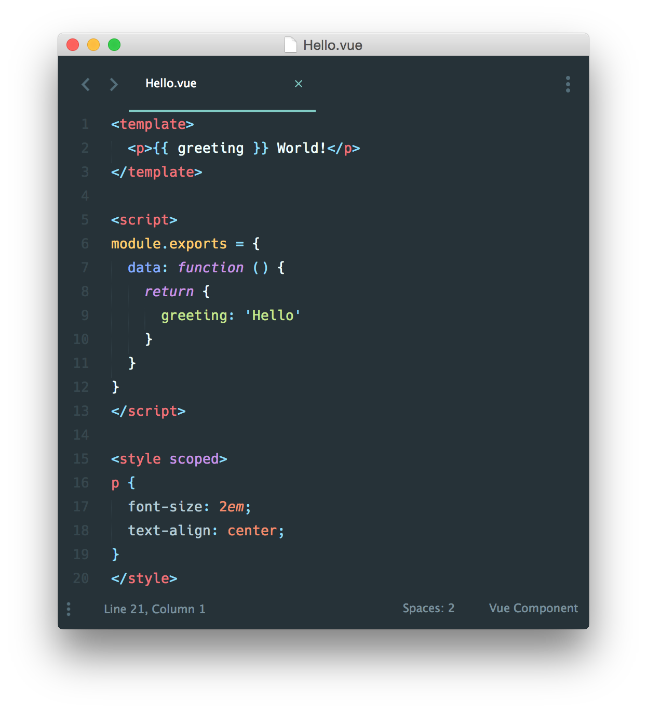

# 开发规范

描述项目各种规范

## 技术选型

* 构建工具: [webpack](https://webpack.github.io/)
* 模块化规范: [ECMAScript 2015](https://en.wikipedia.org/wiki/ECMAScript#6th_Edition_-_ECMAScript_2015)
* 模块化框架: [webpack](https://webpack.github.io/)
* 组件化框架: [vue.js(2.x)](http://vuejs.org/)
* 资源管理方案: 抽取公共库,以页面为单位简单打包

## 目录结构

```bash
src
  ├─ api            # 数据通讯模块
  ├─ assets         # 非模块化资源
  │  ├─ iconfonts     # 字体图标资源
  │  ├─ images        # 图片资源
  │  └─ styles        # 通用样式资源
  ├─ components     # 组件资源
  ├─ views          # 页面
  ├─ const.js       # 常量模块
  ├─ index.html     # 首页（开发）
  ├─ page.js        # 页面启动帮助模块
  └─ pages.conf.js  # 页面模块注册文件

```

目录说明:

* 可看目录后面的注释
* ``api`` 目录用于存放数据通讯模块（各种ajax）
* ``components`` 目录用于存放组件资源, 每个组件一个vue单文件（命名AxxBxx.vue）
* ``views`` 目录存放页面, 每个模块一个目录并且每个页面一个目录, 其中维护模块所需的 js, css, vue 以及 图片 等资源
* ``pages.conf.js`` 页面模块注册文件，新增的页面需要在文件中注册

 ```js
    /*
     * 比如 需要在模块A中增加一个a-1页面
     * 
     * 首先 views 目录下建立 A/a-1.js
     *
     */
    
    module.exports = {
      pages: [
        {
          title: '例子',
          block: [
            {
              entry: 'home/index',
              title: '首页'
            },
            {
              entry: 'form/index',
              title: "表单"
            },
          ]
        },
        // ..... 
        {
          title: 'A',
          block: [
            {
              entry: 'a/a-1',// views 目录下的路径（后缀js省略）
              title: 'a-1'
            },
          ]
        },
      ]
    }
    ```


## 模块化开发 

* 采用 ES6 的模块系统，通过``webpack``相关 ``loader``编译加载。
* ES6 的模块自动开启严格模式，即使你没有写 ``'use strict'``。
* 你可以在模块中使用 ``import`` 和 ``export``。

> 更多信息，请查看[ES6模块系统相关资料](https://hacks.mozilla.org/2015/08/es6-in-depth-modules/) [ES6 Module](http://es6.ruanyifeng.com/#docs/module)


## 模块路径

在模块化开发中, 通过js中的 ``import(path)`` 函数可以标记对资源的引用, 其参数为资源路径.

资源路径支持相对路径或绝对路径定位资源, 相对路径是相对当前文件, 绝对路径是相对项目根目录, 在本项目中, 根目录为 ``src`` 目录

模块路径可以通过如下示例来了解其规则:

|文件路径|模块路径绝对定位|
|-------|-----|
|src/foo.js|src/foo.js|
|src/components/foo.js|components/foo.js|
|src/assets/foo/foo.js|assets/foo/foo.js|

总之, ``src``,``components``,``assets``可以用绝对路径标示，方便应对页面层级路径过深的情况

## 组件化开发 

当前项目采用 [vue.js](http://vuejs.org/) 作为组件化框架.
采用文件扩展名为 .vue 的 [single-file components(单文件组件)](https://vuefe.cn/guide/single-file-components.html) 形式定义开发组件.




## 组件化拆分与CSS选择器命名 

组件化拆分以 ``BEM`` 作为标准, 所有可独立运行的UI组件均平级存放在 ``components`` 目录下, 每个UI组件内最外层都应该有一层元素包裹, 其class命名为 ``w-组件名``, 其中的 元素(BEM中的E, Element)应以 ``w-组件名`` 为前缀, 比如:

```css
.w-header { ... }
.w-header_title { ... }
.w-header_menu { ... }
```

对应的HTML内容为:

```html
<div class="w-header">
    <h1 class="w-header_title">{{title}}</h1>
    <button class="w-header_menu">菜单</button>
</div>
```

可能大家会有疑问, 什么不这样写呢:

```css
.w-header { ... }
.w-header .title { ... }
.w-header .menu { ... }
```

因为组件与组件是会相互组合使用的, 如果在 .w-header 中有 .title 的定义, 如果header组件组合了其他组件也有自定义的 .title 元素, 其样式就会相互影响.

